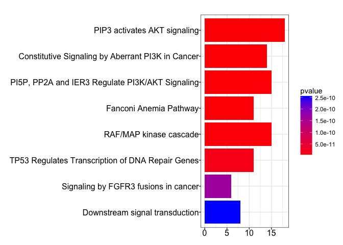
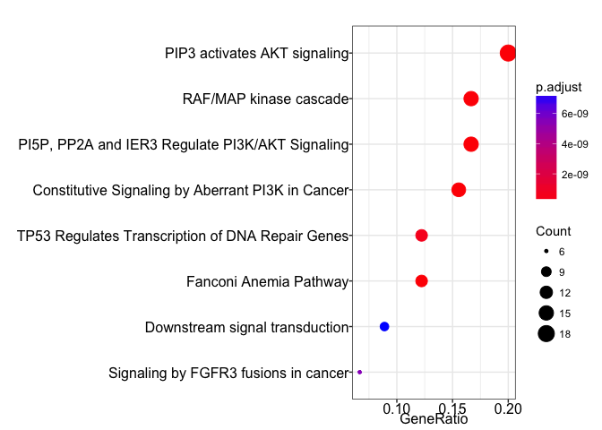
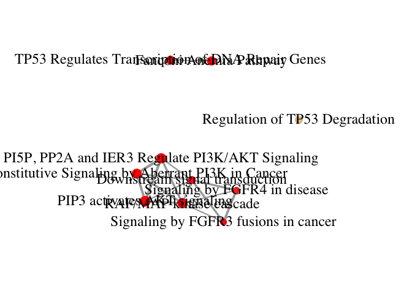
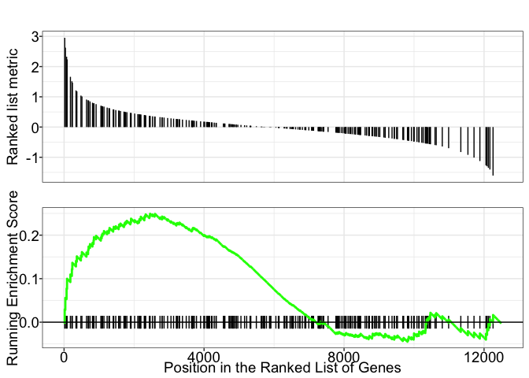
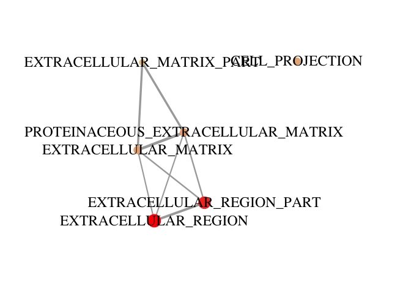
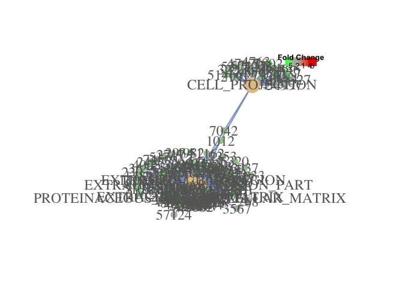
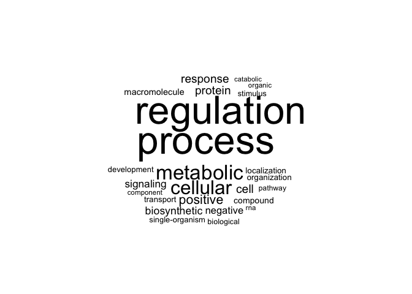
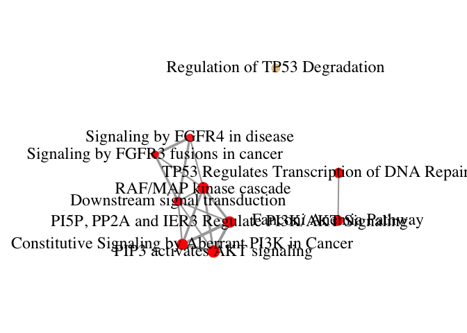
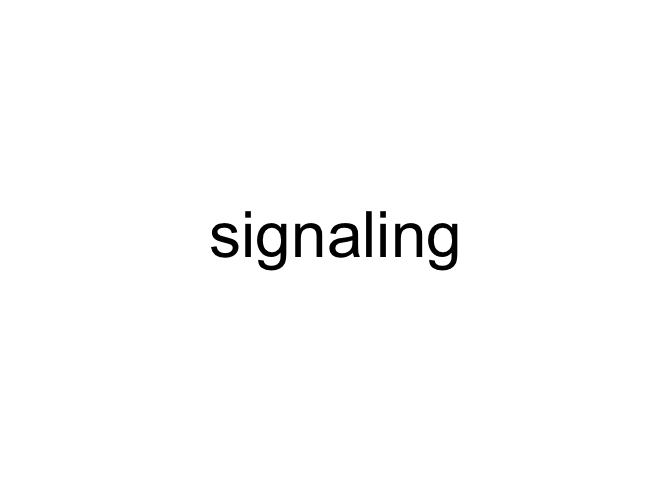

Purpose
-------

Test out clusterProfiler

Load libraries
--------------

``` r
# Bioconductor
library(clusterProfiler)
```

    ## Loading required package: DOSE

    ## 

    ## DOSE v3.0.10  For help: https://guangchuangyu.github.io/DOSE
    ## 
    ## If you use DOSE in published research, please cite:
    ## Guangchuang Yu, Li-Gen Wang, Guang-Rong Yan, Qing-Yu He. DOSE: an R/Bioconductor package for Disease Ontology Semantic and Enrichment analysis. Bioinformatics 2015, 31(4):608-609

    ## clusterProfiler v3.2.11  For help: https://guangchuangyu.github.io/clusterProfiler
    ## 
    ## If you use clusterProfiler in published research, please cite:
    ## Guangchuang Yu., Li-Gen Wang, Yanyan Han, Qing-Yu He. clusterProfiler: an R package for comparing biological themes among gene clusters. OMICS: A Journal of Integrative Biology. 2012, 16(5):284-287.

``` r
library(paxtoolsr)
```

    ## Loading required package: rJava

    ## Loading required package: XML

    ## Consider citing this package: Luna A, et al. PaxtoolsR: pathway analysis in R using Pathway Commons. PMID: 26685306; citation("paxtoolsr")

``` r
# CRAN
library(wordcloud)
```

    ## Loading required package: RColorBrewer

``` r
library(tm)
```

    ## Loading required package: NLP

``` r
library(igraph)
```

    ## 
    ## Attaching package: 'igraph'

    ## The following object is masked from 'package:clusterProfiler':
    ## 
    ##     simplify

    ## The following objects are masked from 'package:stats':
    ## 
    ##     decompose, spectrum

    ## The following object is masked from 'package:base':
    ## 
    ##     union

``` r
library(magrittr)
```

    ## 
    ## Attaching package: 'magrittr'

    ## The following object is masked from 'package:igraph':
    ## 
    ##     %>%

``` r
library(dplyr)
```

    ## 
    ## Attaching package: 'dplyr'

    ## The following objects are masked from 'package:igraph':
    ## 
    ##     %>%, as_data_frame, groups, union

    ## The following object is masked from 'package:paxtoolsr':
    ## 
    ##     summarize

    ## The following objects are masked from 'package:stats':
    ## 
    ##     filter, lag

    ## The following objects are masked from 'package:base':
    ## 
    ##     intersect, setdiff, setequal, union

Load Gene Sets
--------------

``` r
# clusterProfiler 
gmtfile <- system.file("extdata", "c5.cc.v5.0.entrez.gmt", package="clusterProfiler")
c5 <- read.gmt(gmtfile)
```

    ## Loading required package: GSEABase

    ## Loading required package: BiocGenerics

    ## Loading required package: parallel

    ## 
    ## Attaching package: 'BiocGenerics'

    ## The following objects are masked from 'package:parallel':
    ## 
    ##     clusterApply, clusterApplyLB, clusterCall, clusterEvalQ,
    ##     clusterExport, clusterMap, parApply, parCapply, parLapply,
    ##     parLapplyLB, parRapply, parSapply, parSapplyLB

    ## The following objects are masked from 'package:dplyr':
    ## 
    ##     combine, intersect, setdiff, union

    ## The following objects are masked from 'package:igraph':
    ## 
    ##     normalize, union

    ## The following objects are masked from 'package:rJava':
    ## 
    ##     anyDuplicated, duplicated, sort, unique

    ## The following objects are masked from 'package:stats':
    ## 
    ##     IQR, mad, xtabs

    ## The following objects are masked from 'package:base':
    ## 
    ##     anyDuplicated, append, as.data.frame, cbind, colnames,
    ##     do.call, duplicated, eval, evalq, Filter, Find, get, grep,
    ##     grepl, intersect, is.unsorted, lapply, lengths, Map, mapply,
    ##     match, mget, order, paste, pmax, pmax.int, pmin, pmin.int,
    ##     Position, rank, rbind, Reduce, rownames, sapply, setdiff,
    ##     sort, table, tapply, union, unique, unsplit, which, which.max,
    ##     which.min

    ## Loading required package: Biobase

    ## Welcome to Bioconductor
    ## 
    ##     Vignettes contain introductory material; view with
    ##     'browseVignettes()'. To cite Bioconductor, see
    ##     'citation("Biobase")', and for packages 'citation("pkgname")'.

    ## 
    ## Attaching package: 'Biobase'

    ## The following object is masked from 'package:NLP':
    ## 
    ##     content

    ## Loading required package: annotate

    ## Loading required package: AnnotationDbi

    ## Loading required package: stats4

    ## Loading required package: IRanges

    ## Loading required package: S4Vectors

    ## 
    ## Attaching package: 'S4Vectors'

    ## The following objects are masked from 'package:dplyr':
    ## 
    ##     first, rename

    ## The following object is masked from 'package:igraph':
    ## 
    ##     compare

    ## The following objects are masked from 'package:base':
    ## 
    ##     colMeans, colSums, expand.grid, rowMeans, rowSums

    ## 
    ## Attaching package: 'IRanges'

    ## The following objects are masked from 'package:dplyr':
    ## 
    ##     collapse, desc, regroup, slice

    ## The following object is masked from 'package:igraph':
    ## 
    ##     simplify

    ## 
    ## Attaching package: 'AnnotationDbi'

    ## The following object is masked from 'package:dplyr':
    ## 
    ##     select

    ## Loading required package: graph

    ## 
    ## Attaching package: 'graph'

    ## The following objects are masked from 'package:igraph':
    ## 
    ##     degree, edges, intersection

    ## The following object is masked from 'package:XML':
    ## 
    ##     addNode

``` r
head(c5)
```

    ##           ont  gene
    ## 1 NUCLEOPLASM  3190
    ## 2 NUCLEOPLASM  2547
    ## 3 NUCLEOPLASM 26173
    ## 4 NUCLEOPLASM  9439
    ## 5 NUCLEOPLASM 57508
    ## 6 NUCLEOPLASM  6837

``` r
# PC
pc <- downloadPc2("PathwayCommons.8.Reactome.GSEA.hgnc.gmt.gz", version="8", removePrefix=TRUE)

pcGmt <- data.frame(ont=character(0), gene=character(0))
for(i in 1:length(names(pc))) {
  x <- names(pc)[i]
  pcGmt <- rbind(pcGmt, data.frame(ont=x, gene=pc[[x]]))  
}
head(pcGmt)
```

    ##                      ont  gene
    ## 1 2-LTR circle formation BANF1
    ## 2 2-LTR circle formation HMGA1
    ## 3 2-LTR circle formation  LIG4
    ## 4 2-LTR circle formation PSIP1
    ## 5 2-LTR circle formation XRCC4
    ## 6 2-LTR circle formation XRCC5

``` r
# Bader EnrichmentMap
gmt <- read.gmt("Human_GOBP_AllPathways_no_GO_iea_February_01_2017_symbol.gmt")
gmt$ont <- as.character(gmt$ont)
g1 <- strsplit(gmt$ont, "%")
g2 <- lapply(g1, function(x) {
  x[1]
})
g3 <- gmt
g3$ont <- unlist(g2)
head(g3)
```

    ##                                     ont     gene
    ## 1                PROLINE BIOSYNTHESIS I ALDH18A1
    ## 2                PROLINE BIOSYNTHESIS I    PYCRL
    ## 3                PROLINE BIOSYNTHESIS I    PYCR1
    ## 4 THIO-MOLYBDENUM COFACTOR BIOSYNTHESIS    MOCOS
    ## 5      MOLYBDENUM COFACTOR BIOSYNTHESIS     NFS1
    ## 6      MOLYBDENUM COFACTOR BIOSYNTHESIS    MOCS2

Load Example Data
-----------------

``` r
# For Hypergeometric Test
# REPLACE THIS WITH YOUR ONE GENE LIST. SINGLE COLUMN TEXT FILE, HGNC. 
gene <- read.table("~/Dropbox/drug_target_tmp/clinical_trial_paper/gene_list.txt", stringsAsFactors = FALSE)
gene <- gene$V1

# For GSEA
data(geneList, package="DOSE")
```

Run Enrichment Analyses
-----------------------

``` r
# Hypergeometric
egmt <- enricher(gene, TERM2GENE=pcGmt)
head(egmt)
```

    ##                                                                                                  ID
    ## PIP3 activates AKT signaling                                           PIP3 activates AKT signaling
    ## Constitutive Signaling by Aberrant PI3K in Cancer Constitutive Signaling by Aberrant PI3K in Cancer
    ## PI5P, PP2A and IER3 Regulate PI3K/AKT Signaling     PI5P, PP2A and IER3 Regulate PI3K/AKT Signaling
    ## Fanconi Anemia Pathway                                                       Fanconi Anemia Pathway
    ## RAF/MAP kinase cascade                                                       RAF/MAP kinase cascade
    ## TP53 Regulates Transcription of DNA Repair Genes   TP53 Regulates Transcription of DNA Repair Genes
    ##                                                                                         Description
    ## PIP3 activates AKT signaling                                           PIP3 activates AKT signaling
    ## Constitutive Signaling by Aberrant PI3K in Cancer Constitutive Signaling by Aberrant PI3K in Cancer
    ## PI5P, PP2A and IER3 Regulate PI3K/AKT Signaling     PI5P, PP2A and IER3 Regulate PI3K/AKT Signaling
    ## Fanconi Anemia Pathway                                                       Fanconi Anemia Pathway
    ## RAF/MAP kinase cascade                                                       RAF/MAP kinase cascade
    ## TP53 Regulates Transcription of DNA Repair Genes   TP53 Regulates Transcription of DNA Repair Genes
    ##                                                   GeneRatio  BgRatio
    ## PIP3 activates AKT signaling                          18/90  81/9057
    ## Constitutive Signaling by Aberrant PI3K in Cancer     14/90  61/9057
    ## PI5P, PP2A and IER3 Regulate PI3K/AKT Signaling       15/90  83/9057
    ## Fanconi Anemia Pathway                                11/90  39/9057
    ## RAF/MAP kinase cascade                                15/90 116/9057
    ## TP53 Regulates Transcription of DNA Repair Genes      11/90  61/9057
    ##                                                         pvalue
    ## PIP3 activates AKT signaling                      4.153404e-20
    ## Constitutive Signaling by Aberrant PI3K in Cancer 4.949144e-16
    ## PI5P, PP2A and IER3 Regulate PI3K/AKT Signaling   1.912643e-15
    ## Fanconi Anemia Pathway                            6.646580e-14
    ## RAF/MAP kinase cascade                            3.339606e-13
    ## TP53 Regulates Transcription of DNA Repair Genes  1.388858e-11
    ##                                                       p.adjust
    ## PIP3 activates AKT signaling                      9.677432e-18
    ## Constitutive Signaling by Aberrant PI3K in Cancer 5.765753e-14
    ## PI5P, PP2A and IER3 Regulate PI3K/AKT Signaling   1.485486e-13
    ## Fanconi Anemia Pathway                            3.871633e-12
    ## RAF/MAP kinase cascade                            1.556257e-11
    ## TP53 Regulates Transcription of DNA Repair Genes  5.393397e-10
    ##                                                         qvalue
    ## PIP3 activates AKT signaling                      4.984085e-18
    ## Constitutive Signaling by Aberrant PI3K in Cancer 2.969486e-14
    ## PI5P, PP2A and IER3 Regulate PI3K/AKT Signaling   7.650571e-14
    ## Fanconi Anemia Pathway                            1.993974e-12
    ## RAF/MAP kinase cascade                            8.015055e-12
    ## TP53 Regulates Transcription of DNA Repair Genes  2.777715e-10
    ##                                                                                                                                                      geneID
    ## PIP3 activates AKT signaling                      EGFR/PDGFRB/PDGFRA/KIT/AKT1/PTEN/PIK3CA/PIK3CB/ERBB2/ERBB3/FGFR4/FGFR2/FGFR3/FGFR1/FGF19/AKT3/PIK3R1/MTOR
    ## Constitutive Signaling by Aberrant PI3K in Cancer                     EGFR/PDGFRB/PDGFRA/KIT/PIK3CA/PIK3CB/ERBB2/ERBB3/FGFR4/FGFR2/FGFR3/FGFR1/FGF19/PIK3R1
    ## PI5P, PP2A and IER3 Regulate PI3K/AKT Signaling                  EGFR/PDGFRB/PDGFRA/KIT/AKT1/PIK3CA/PIK3CB/ERBB2/ERBB3/FGFR4/FGFR2/FGFR3/FGFR1/FGF19/PIK3R1
    ## Fanconi Anemia Pathway                                                                     FANCD2/FANCG/FANCF/FANCE/ATR/FANCB/FANCA/FANCL/FANCC/FANCM/FANCI
    ## RAF/MAP kinase cascade                                                  HRAS/NRAS/KRAS/EGFR/PDGFRB/PDGFRA/RET/KIT/ERBB2/ERBB3/FGFR4/FGFR2/FGFR3/FGFR1/FGF19
    ## TP53 Regulates Transcription of DNA Repair Genes                                                BRCA1/TP53/FANCD2/ATM/ATR/FANCC/RAD51D/FANCI/MSH2/PMS2/MLH1
    ##                                                   Count
    ## PIP3 activates AKT signaling                         18
    ## Constitutive Signaling by Aberrant PI3K in Cancer    14
    ## PI5P, PP2A and IER3 Regulate PI3K/AKT Signaling      15
    ## Fanconi Anemia Pathway                               11
    ## RAF/MAP kinase cascade                               15
    ## TP53 Regulates Transcription of DNA Repair Genes     11

``` r
barplot(egmt, showCategory=8)
```



``` r
dotplot(egmt, showCategory=8)
```



``` r
enrichMap(egmt, n=10, vertex.label.font=0.05)
```



``` r
# GSEA 
geneList <- sort(geneList, decreasing = TRUE)
egmt2 <- GSEA(geneList, TERM2GENE=c5, verbose=FALSE)
gseaplot(egmt2, "NUCLEOPLASM")
```



igraph Objects returned convertable to cytoscape
------------------------------------------------

``` r
b <- enrichMap(egmt2, n=6)
```



``` r
a <- cnetplot(egmt2, categorySize="pvalue", foldChange=geneList, vertex.label.font=0.05)
```



``` r
class(b)
```

    ## [1] "igraph"

``` r
class(a)
```

    ## [1] "igraph"

Make Word Cloud from PC GMT
---------------------------

``` r
# Wordcloud
corpus <- Corpus(VectorSource(sample(g3$ont, 10000)))
corpus <- tm_map(corpus, PlainTextDocument)
#corpus <- tm_map(corpus, removePunctuation, preserve_intra_word_dashes=TRUE)
corpus <- tm_map(corpus, removeWords, stopwords('english'))
corpus <- tm_map(corpus, removeWords, c("events", "synthesis", "causes", "pathway", "superpathway", "regulation", "process"))
wordcloud(corpus, max.words = 25, random.order = FALSE)
```



Get communities (modules)
-------------------------

``` r
x <- enrichMap(egmt, n=10, vertex.label.font=0.05)
```



``` r
ebc <- cluster_edge_betweenness(x)
e1 <- membership(ebc)

e2 <- names(which(e1 == 1))
e3 <- gsub("[[:punct:]]", " ", e2)

corpus <- Corpus(VectorSource(e3))
corpus <- tm_map(corpus, PlainTextDocument)
#corpus <- tm_map(corpus, removePunctuation, preserve_intra_word_dashes=TRUE)
#corpus <- tm_map(corpus, removeWords, stopwords('english'))
#corpus <- tm_map(corpus, removeWords, c("events", "synthesis", "causes", "pathway", "superpathway", "regulation", "process"))

dtm <- TermDocumentMatrix(corpus)
freq <- colSums(as.matrix(dtm))
findFreqTerms(dtm)
```

    ##  [1] "aberrant"     "activates"    "akt"          "and"         
    ##  [5] "cancer"       "cascade"      "constitutive" "disease"     
    ##  [9] "downstream"   "fgfr3"        "fgfr4"        "fusions"     
    ## [13] "ier3"         "kinase"       "map"          "pi3k"        
    ## [17] "pi5p"         "pip3"         "pp2a"         "raf"         
    ## [21] "regulate"     "signal"       "signaling"    "transduction"

``` r
terms <- findFreqTerms(dtm)
termFreq <- dtm[terms,] %>%
      as.matrix() %>%
      rowSums()  %>% 
      data.frame(Term = terms, Frequency = .) %>%  
      arrange(desc(Frequency))

tf1 <- termFreq[termFreq$Frequency > 1,]

ebcGenes <- NULL 
for(i in 1:length(e2)) {
  genesInPathway <- gene[gene %in% pc[[e2[i]]]]
  
  ebcGenes <- c(ebcGenes, genesInPathway)
}

ebcGenes <- unique(ebcGenes)

wordcloud(corpus, max.words = 25, min.freq=3, random.order = FALSE)
```



``` r
# Recurrent words in module and frequency
tf1
```

    ##        Term Frequency
    ## 1 signaling         5
    ## 2       akt         2
    ## 3    cancer         2
    ## 4      pi3k         2

``` r
# Genes in module
ebcGenes
```

    ##  [1] "EGFR"   "PDGFRB" "PDGFRA" "KIT"    "AKT1"   "PTEN"   "PIK3CA"
    ##  [8] "PIK3CB" "ERBB2"  "ERBB3"  "FGFR4"  "FGFR2"  "FGFR3"  "FGFR1" 
    ## [15] "FGF19"  "AKT3"   "PIK3R1" "MTOR"   "HRAS"   "NRAS"   "KRAS"  
    ## [22] "RET"

Write igraph to cytoscape.js in JSON file
-----------------------------------------

-   Example: <http://jsbin.com/sifuxopase/1/edit?js,output>

``` r
source("toCytoscape.R")
library(jsonlite)
```

    ## 
    ## Attaching package: 'jsonlite'

    ## The following object is masked from 'package:paxtoolsr':
    ## 
    ##     validate

``` r
bg <- toCytoscape(x)
```

    ## [1] "Done."

``` r
bg
```

    ## {
    ##   "data": {},
    ##   "elements": {
    ##     "nodes": [
    ##       {
    ##         "data": {
    ##           "name": "PIP3 activates AKT signaling",
    ##           "color": "#FF0000",
    ##           "size": 12.5527,
    ##           "id": "PIP3 activates AKT signaling"
    ##         }
    ##       },
    ##       {
    ##         "data": {
    ##           "name": "Constitutive Signaling by Aberrant PI3K in Cancer",
    ##           "color": "#FF0000",
    ##           "size": 11.4613,
    ##           "id": "Constitutive Signaling by Aberrant PI3K in Cancer"
    ##         }
    ##       },
    ##       {
    ##         "data": {
    ##           "name": "PI5P, PP2A and IER3 Regulate PI3K/AKT Signaling",
    ##           "color": "#FF0000",
    ##           "size": 11.7609,
    ##           "id": "PI5P, PP2A and IER3 Regulate PI3K/AKT Signaling"
    ##         }
    ##       },
    ##       {
    ##         "data": {
    ##           "name": "Fanconi Anemia Pathway",
    ##           "color": "#FF0000",
    ##           "size": 10.4139,
    ##           "id": "Fanconi Anemia Pathway"
    ##         }
    ##       },
    ##       {
    ##         "data": {
    ##           "name": "RAF/MAP kinase cascade",
    ##           "color": "#FF0000",
    ##           "size": 11.7609,
    ##           "id": "RAF/MAP kinase cascade"
    ##         }
    ##       },
    ##       {
    ##         "data": {
    ##           "name": "TP53 Regulates Transcription of DNA Repair Genes",
    ##           "color": "#FE0101",
    ##           "size": 10.4139,
    ##           "id": "TP53 Regulates Transcription of DNA Repair Genes"
    ##         }
    ##       },
    ##       {
    ##         "data": {
    ##           "name": "Signaling by FGFR3 fusions in cancer",
    ##           "color": "#FB1711",
    ##           "size": 7.7815,
    ##           "id": "Signaling by FGFR3 fusions in cancer"
    ##         }
    ##       },
    ##       {
    ##         "data": {
    ##           "name": "Downstream signal transduction",
    ##           "color": "#FA231A",
    ##           "size": 9.0309,
    ##           "id": "Downstream signal transduction"
    ##         }
    ##       },
    ##       {
    ##         "data": {
    ##           "name": "Signaling by FGFR4 in disease",
    ##           "color": "#F73528",
    ##           "size": 7.7815,
    ##           "id": "Signaling by FGFR4 in disease"
    ##         }
    ##       },
    ##       {
    ##         "data": {
    ##           "name": "Regulation of TP53 Degradation",
    ##           "color": "#E5C494",
    ##           "size": 9.0309,
    ##           "id": "Regulation of TP53 Degradation"
    ##         }
    ##       }
    ##     ],
    ##     "edges": [
    ##       {
    ##         "data": {
    ##           "source": "PIP3 activates AKT signaling",
    ##           "target": "Constitutive Signaling by Aberrant PI3K in Cancer",
    ##           "width": 3.9441
    ##         }
    ##       },
    ##       {
    ##         "data": {
    ##           "source": "PIP3 activates AKT signaling",
    ##           "target": "PI5P, PP2A and IER3 Regulate PI3K/AKT Signaling",
    ##           "width": 4.0825
    ##         }
    ##       },
    ##       {
    ##         "data": {
    ##           "source": "Constitutive Signaling by Aberrant PI3K in Cancer",
    ##           "target": "PI5P, PP2A and IER3 Regulate PI3K/AKT Signaling",
    ##           "width": 4.3205
    ##         }
    ##       },
    ##       {
    ##         "data": {
    ##           "source": "PIP3 activates AKT signaling",
    ##           "target": "RAF/MAP kinase cascade",
    ##           "width": 3.1623
    ##         }
    ##       },
    ##       {
    ##         "data": {
    ##           "source": "Constitutive Signaling by Aberrant PI3K in Cancer",
    ##           "target": "RAF/MAP kinase cascade",
    ##           "width": 3.496
    ##         }
    ##       },
    ##       {
    ##         "data": {
    ##           "source": "PI5P, PP2A and IER3 Regulate PI3K/AKT Signaling",
    ##           "target": "RAF/MAP kinase cascade",
    ##           "width": 3.4028
    ##         }
    ##       },
    ##       {
    ##         "data": {
    ##           "source": "Fanconi Anemia Pathway",
    ##           "target": "TP53 Regulates Transcription of DNA Repair Genes",
    ##           "width": 2.1082
    ##         }
    ##       },
    ##       {
    ##         "data": {
    ##           "source": "RAF/MAP kinase cascade",
    ##           "target": "Signaling by FGFR3 fusions in cancer",
    ##           "width": 2.1693
    ##         }
    ##       },
    ##       {
    ##         "data": {
    ##           "source": "PIP3 activates AKT signaling",
    ##           "target": "Downstream signal transduction",
    ##           "width": 2.1822
    ##         }
    ##       },
    ##       {
    ##         "data": {
    ##           "source": "Constitutive Signaling by Aberrant PI3K in Cancer",
    ##           "target": "Downstream signal transduction",
    ##           "width": 2.4254
    ##         }
    ##       },
    ##       {
    ##         "data": {
    ##           "source": "PI5P, PP2A and IER3 Regulate PI3K/AKT Signaling",
    ##           "target": "Downstream signal transduction",
    ##           "width": 2.357
    ##         }
    ##       },
    ##       {
    ##         "data": {
    ##           "source": "RAF/MAP kinase cascade",
    ##           "target": "Downstream signal transduction",
    ##           "width": 2.357
    ##         }
    ##       },
    ##       {
    ##         "data": {
    ##           "source": "Signaling by FGFR3 fusions in cancer",
    ##           "target": "Downstream signal transduction",
    ##           "width": 3.3333
    ##         }
    ##       },
    ##       {
    ##         "data": {
    ##           "source": "RAF/MAP kinase cascade",
    ##           "target": "Signaling by FGFR4 in disease",
    ##           "width": 2.1693
    ##         }
    ##       },
    ##       {
    ##         "data": {
    ##           "source": "Signaling by FGFR3 fusions in cancer",
    ##           "target": "Signaling by FGFR4 in disease",
    ##           "width": 3.7796
    ##         }
    ##       },
    ##       {
    ##         "data": {
    ##           "source": "Downstream signal transduction",
    ##           "target": "Signaling by FGFR4 in disease",
    ##           "width": 3.3333
    ##         }
    ##       }
    ##     ]
    ##   }
    ## }

``` r
write(bg, "enrich.json")
```
